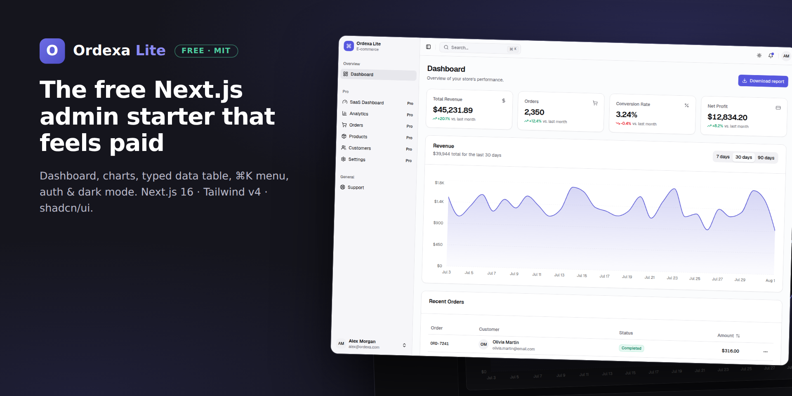
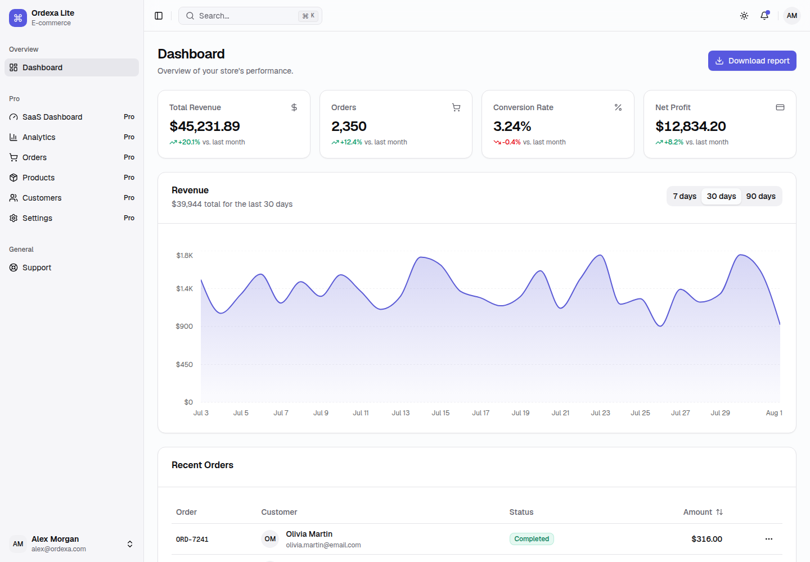
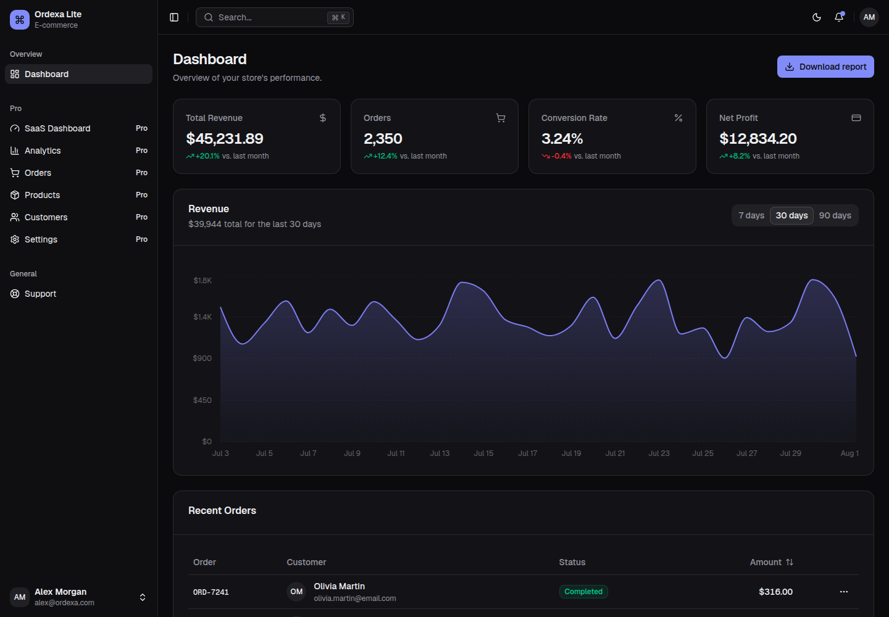

<p align="center">
  
</p>

<h1 align="center">Ordexa Lite</h1>

<p align="center">
  <strong>The free Next.js admin starter that feels paid.</strong><br />
  Production-quality dashboard, charts, typed data table, ⌘K menu, auth, and flawless dark mode — MIT-licensed.
</p>

<p align="center">
  <a href="https://gumroad.com/l/ordexa"></a>
  
  
  
  
</p>

---

## Why this one?

Most free admin starters are either a screenshot with half the code missing, or
a decade of jQuery in a trench coat. Ordexa Lite is the **actual core of a
commercial template** — same architecture, same code quality, no strings:

- ⚡ **Current stack, no legacy** — Next.js 16 App Router, React 19, Tailwind
  CSS v4 (CSS-token theming), shadcn/ui, TanStack Table v8.
- 🧭 **Config-driven navigation** — the sidebar *and* the ⌘K command menu
  render from one typed config file. Add a page, add one entry, done.
- 📊 **Charts you can trust** — the palette is colorblind-validated (CVD ΔE
  checks on adjacent pairs), tuned separately for light and dark.
- 🧱 **A DataTable worth reusing** — strictly typed generics on TanStack v8,
  sorting wired up, drop in your own columns.
- 🌗 **Dark mode done right** — class-based, flash-free, every token designed
  for both themes.
- 🛡️ **Strict TypeScript + JSDoc on everything**, zero TODOs, and mock data
  whose types double as your API contract.

| Light | Dark |
| --- | --- |
|  |  |

## Quickstart

```bash
git clone https://github.com/tovrr/ordexa-lite
cd ordexa-lite
npm install
npm run dev
```

Open [http://localhost:3000](http://localhost:3000). No env vars, no external
services — it just runs.

## Customizing

| Change | Where |
| --- | --- |
| Branding (name, links) | `config/site.ts` |
| Navigation & ⌘K menu | `config/menu.ts` — typed links, badges, collapsible groups |
| Colors, radius, charts | `app/globals.css` — every token, Tailwind v4, no config file |
| Demo data → your API | `lib/mock-data.ts` — keep the exported types as your contract |
| New page | Create `app/(dashboard)/your-page/page.tsx`, add one menu entry |

## Lite vs. Pro — the smart-choice table

Lite is genuinely useful on its own. When your project grows past one
dashboard, [**Ordexa Pro**](https://gumroad.com/l/ordexa) is the same
architecture with the rest of the app already built — buying it is cheaper
than one afternoon of your time:

| | Lite (free) | [Pro](https://gumroad.com/l/ordexa) |
| --- | :-: | :-: |
| E-commerce dashboard | ✅ | ✅ |
| SaaS dashboard + Analytics page | — | ✅ |
| Orders / Products / Customers management | — | ✅ |
| DataTable: search, faceted filters, pagination, column toggle | — | ✅ |
| Auth: register, forgot & reset password | login only | ✅ |
| Settings (react-hook-form + Zod cookbook) | — | ✅ |
| Pricing, printable invoice, profile pages | — | ✅ |
| 4 switchable brand presets | — | ✅ |
| Full RTL with live toggle | — | ✅ |

<p align="center">
  <a href="https://gumroad.com/l/ordexa"><strong>Get Ordexa Pro →</strong></a>
</p>

## Support the project

If Lite saves you time, **star the repo** ⭐ — it's how other developers find
it — and tell us what you build. Issues and suggestions welcome.

## License

MIT — free for personal and commercial use. See [LICENSE.md](./LICENSE.md).
Built on Next.js, React, Tailwind CSS, Radix UI, shadcn/ui, TanStack Table,
Recharts, react-hook-form, Zod, next-themes, and Lucide — all MIT.
